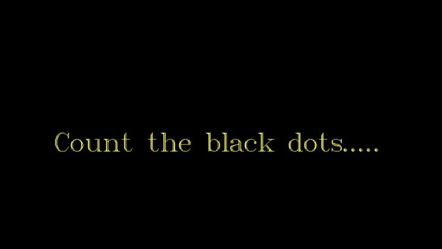
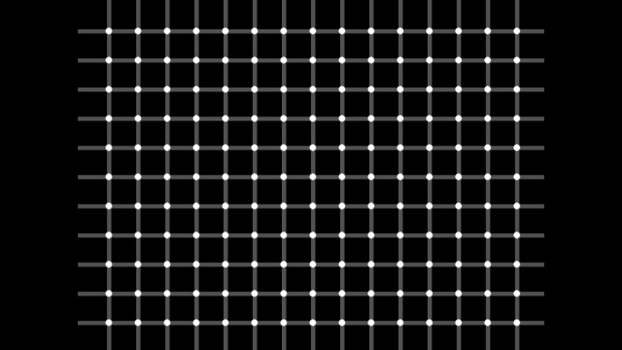
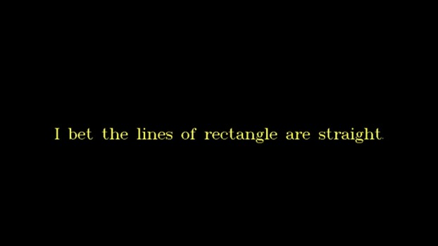
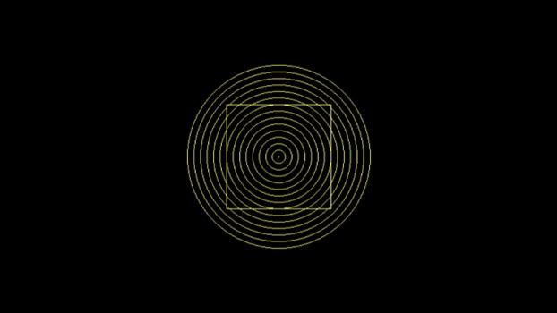

# Optical Illusion in C
This repository demonstrates simple optical illusions and patterns using the old Borland Graphics Interface (&lt;graphics.h>). The C code draws grids of dots, concentric circles, and rectangles creating visual effects such as phantom dots and seemingly curved lines. 

## Features

- **Geometric Illusions:** Displays concentric circles, rectangles, and dotted grids that produce optical illusions.
- **Legacy Graphics:** Utilizes `<graphics.h>` functions, demonstrating retro-style graphics programming in C.
- **User Interaction:** Prompts for keypresses, allowing you to pause and observe illusions at your own pace.

## Screenshots 

